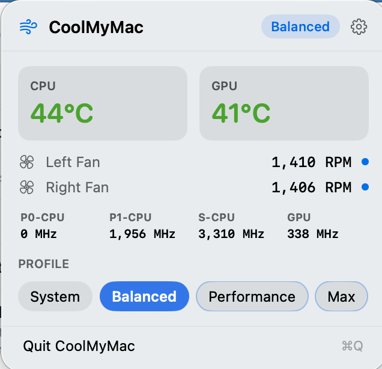

# CoolMyMac


A modern, lightweight (2MB) macOS fan control and thermal management utility for macOS 15.0+ with a Menu Bar interface. Supports both Intel and Apple Silicon Macs. 

<p align="center">
  
</p>

## Table of Contents
- [Installation](#installation)
- [Features](#features)
- [Architecture](#architecture)
- [Build from Source](#build-from-source)
- [Contributing](#contributing)
- [License](#license)

## Installation

### Method 1: Homebrew (Recommended)
You can seamlessly install CoolMyMac and its accompanying CLI tool using Homebrew:
```bash
brew tap ecc521/coolmymac
brew install --cask coolmymac
```

### Method 2: DMG Download
Download the latest `CoolMyMac.dmg` from the [Releases](https://github.com/ecc521/CoolMyMac/releases) page. Open the DMG and simply drag `CoolMyMac.app` to your `/Applications` folder.

### Post-Installation
After launching CoolMyMac, open **Preferences** (click the gear icon) and click **Install Helper Tool** in the General tab. This is required for active fan control and the full sensor suite.

## Features
- **Dynamic Menu Bar Icon**: Menu bar icon automatically shifts from green to red as your CPU/GPU gets hotter.
- **Apple Silicon & Intel SMC Support**: Native, low-level IOKit sensor readings for package power, CPU/GPU temps, and clock speeds.
- **Fan Curves**:
  - `Quiet`: Leaves Apple's default thermal management fully in control.
  - `Balanced`: Similar to Apple's defaults, but slightly more aggressive. _Allows fans to turn off_ (<40°C)
  - `Performance`: Higher minimum RPMs and an aggressive ramp-up to max speed around 85°C.
  - `Max`: Forces all fans to run at maximum speed.
  - `Custom`: Anything you want! 
- **Command Line Interface (CLI)**: `coolmymac` tool for scripting profile changes (`coolmymac temps`, `coolmymac fans`, `coolmymac profile set max`).

## Architecture
- **App**: A SwiftUI MenuBarExtra application containing the Preferences window.
- **Daemon**: A secure `SMAppService` LaunchDaemon running as `root` (with an XPC listener) required to write speeds to the SMC.
- **CLI**: A standalone Swift package binary embedded in the App.

## Build from Source

CoolMyMac is built entirely through Xcode. The Command Line Tool and Helper Tool are automatically compiled and embedded into the main App during the build process.

### 1. Clone the Repository
```bash
git clone https://github.com/ecc521/CoolMyMac.git
cd CoolMyMac
```

### 2. Configure Code Signing (Required)
Because macOS requires Helper Tools installed via `SMAppService` to be code-signed by the exact same Team ID as the host app, you **must** configure code signing before building:
1. Open `CoolMyMac-App/CoolMyMac.xcodeproj` in Xcode.
2. Select the `CoolMyMac` project file in the Project Navigator.
3. Select the `CoolMyMac` target -> **Signing & Capabilities**.
4. Select your Personal Team or Apple Developer ID.
5. Repeat this exact process for the `CoolMyMac-Daemon` target.

### 3. Build and Run
Once code signing is configured:
1. Select the `CoolMyMac` scheme in the top bar.
2. Hit **Cmd + R** (Run).
3. The app will compile (along with the embedded CLI and Daemon) and appear in your Mac's Menu Bar.
4. Click the gear icon to open Preferences, and click **Install Helper Tool** to activate fan control.

## Contributing
Please see [Contributing Guidelines](CONTRIBUTING.md) for more details on how to set up your environment and submit Pull Requests.

## License
This project is licensed under the [GNU General Public License v3.0](LICENSE).
